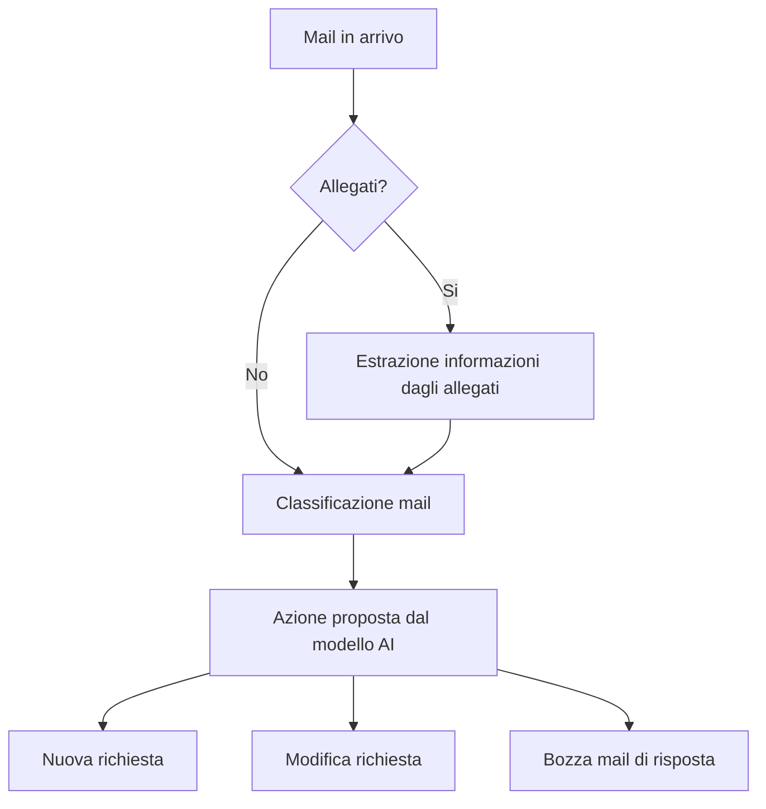

# ADR-008 – Modelli AI

## Status

Accepted

## Requisiti generali

Dopo svariate prove su diversi modelli mi sono reso conto che con l'hardware a disposizione (Notebook DELL i5 no GPU) risulta monto "faticoso" per un unico modello AI portare a termine le analisi senza sbagliare.

## Decisione

Per questo motivo ho deciso di utilizzare più modelli AI in sequenza, in modo da poter suddividere il carico elaborativo in tre fasi distinte e assegnare ogni fase a un medello specifico:
1. **Fase 1**: In presenza di allegati nella mail in arrivo, inviare i file allegati a un modello "Visual" per ottenere un riassunto del contenuto (modello AI: `request-assistant-vision-v1`)
2. **Fase 2**: Classificazione del messaggio in arrivo, arricchito con eventuale contesto degli allegati, ed eventuale Request già presente nel DB. Le uniche risposte che il modello AI può dare sono: "NUOVA_RICHIESTA", "MODIFICA_RICHIESTA", "RISPONDI_A_MAIL". (modello AI: `request-assistant-classificatore-v7`, [../ollama/model-definitions/request-assistant/classificatore/Modelfile-v7.txt])
3. **Fase 3**: In base alla risposta ottenuta nella fase 2, un altro modello in base all'invio di tutto il contesto fin'ora costruito, restituirà: una bozza di mail di risposta ("RISPONDI_A_MAIL"), oppure una bozza di richiesta da inserire nel DB ("NUOVA_RICHIESTA"), oppure una bozza di richiesta modificata rispetto all'input inviato ("MODIFICA_RICHIESTA"). (modello AI: `request-assistant-generatore-v2`)

Tutti i modelli sono richiamabili tramite api/chat di Ollama.



## Fase 1: Visual
In questa fase, il modello AI `request-assistant-vision-v1` riceve in input i file allegati alla mail in arrivo (un file alla volta codificato in base64) e restituisce un riassunto del contenuto. Questo riassunto sarà poi utilizzato nella fase successiva per arricchire il contesto della mail e facilitare la classificazione.

### Request
```json
{
  "model": "request-assistant-vision-v1",
  "messages": [
    {
      "role": "user",
      "content": "Analizza l'immagine.",
      "images": [
        "<BASE64_IMAGE>"
      ]
    }
  ],
  "think": false,
  "stream": false,
  "options": {
    "temperature": 0,
    "top_k": 20,
    "top_p": 0.9
  }
}
```


### Response
```json
{
  "model": "request-assistant-vision-v1",
  "created_at": "2026-10-08T14:57:50.536904845Z",
  "message": {
    "role": "assistant",
    "content": "Utente:\nnon presente\nNome e cognome:\nnon presente\nServizio o sistema:\nnon presente\nAmbiente:\nnon presente\nOperazione richiesta o tentata:\nnon presente\nErrore:\nnon presente\nCodice errore:\nnon presente\nInformazioni tecniche:\nnon presente\nInformazioni non presenti o non leggibili:\nNome e cognome, Servizio o sistema, Ambiente, Operazione richiesta o tentata, Errore, Codice errore, Informazioni tecniche"
  },
  "done": true,
  "done_reason": "stop",
  "total_duration": 400146691568,
  "load_duration": 37210349215,
  "prompt_eval_count": 1359,
  "prompt_eval_cached_count": 0,
  "prompt_eval_duration": 321404280000,
  "eval_count": 109,
  "eval_duration": 41406060000
}
```

## Fase 2: Classificazione
In questa fase, il modello AI `request-assistant-classificatore-v7` riceve in input il contenuto della mail in arrivo, arricchito con eventuale contesto degli allegati e con l'eventuale Request già presente nel DB. Il modello restituirà una delle tre risposte possibili: "NUOVA_RICHIESTA", "MODIFICA_RICHIESTA", "RISPONDI_A_MAIL".

### Request
```json
{
  "model": "request-assistant-classificatore-v7",
  "messages": [
    {
      "role": "user",
      "content": "{\"message\":{\"subject\":\"richiesta abilitazione db svil e coll\",\"bodyText\":\"Ciao, per esigenze di progetto ho bisogno di essere abilitato in lettura ed in scrittura ai DB oracle di sviluppo e collaudo. Nome: Mario. Cognome: Rossi. User: u83172\"},\"request\":null,\"attachmentContext\":null}"
    }
  ],
  "think": false,
  "stream": false
}
```
```java
public class ClassificatoreContent {
    private Message message;
    private Request request;
    private List<String> attachmentContext;

    // Getters and setters
}
```

### Response
```json
{
  "model": "request-assistant-classificatore-v7",
  "created_at": "2026-10-01T10:34:38.791539305Z",
  "message": {
    "role": "assistant",
    "content": "{\n  \"action\": \"NUOVA_RICHIESTA\",\n  \"confidence\": 95,\n  \"reasons\": \"Il messaggio contiene informazioni complete per definire una richiesta: anagrafica utente, user, servizio oggetto della richiesta (abilitazione ai DB oracle).\"\n}"
  },
  "done": true,
  "done_reason": "stop",
  "total_duration": 302362733387,
  "load_duration": 3836350197,
  "prompt_eval_count": 904,
  "prompt_eval_cached_count": 0,
  "prompt_eval_duration": 267127381000,
  "eval_count": 69,
  "eval_duration": 31383263000
}
```
```java
public class ClassificatoreResponse {
    private String action;
    private int confidence;
    private String reasons;

    // Getters and setters
}
```

## Fase 3: Generazione
In questa fase, il modello AI `request-assistant-generatore-v2` riceve in input il contenuto della mail in arrivo, arricchito con eventuale contesto degli allegati e con l'eventuale Request già presente nel DB, insieme all'azione proposta dal modello della fase 2. Il modello restituirà una bozza di mail di risposta, una bozza di richiesta da inserire nel DB, oppure una bozza di richiesta modificata rispetto all'input inviato.

### Request
```json
{
  "model": "request-assistant-generatore-v2",
  "messages": [
    {
      "role": "user",
      "content": "{\"action\":\"NUOVA_RICHIESTA\",\"message\":{\"id\":126,\"subject\":\"Richiesta accesso DB Oracle\",\"senderAddress\":\"mario.rossi@example.it\",\"receivedAt\":\"2026-10-07T10:00:00\",\"to\":\"support@example.it\",\"cc\":null,\"bodyText\":\"Buongiorno, sono Mario Rossi. Avrei bisogno di un accesso al DB Oracle in ambiente di sviluppo. Grazie.\",\"entryId\":\"ABC126\",\"conversationId\":\"CONV101\",\"conversationTopic\":\"Richiesta accesso DB Oracle\",\"importance\":1,\"hasAttachment\":false,\"category\":null},\"request\":null,\"attachmentContext\":[]}"
    }
  ],
  "think": false,
  "stream": false,
  "keep_alive": "30m",
  "format": {
    "type": "object",
    "properties": {
      "message": {
        "type": [
          "object",
          "null"
        ],
        "properties": {
          "subject": {
            "type": [
              "string",
              "null"
            ]
          },
          "senderAddress": {
            "type": [
              "string",
              "null"
            ]
          },
          "to": {
            "type": [
              "string",
              "null"
            ]
          },
          "cc": {
            "type": [
              "string",
              "null"
            ]
          },
          "bodyText": {
            "type": [
              "string",
              "null"
            ]
          }
        },
        "required": [
          "subject",
          "senderAddress",
          "to",
          "cc",
          "bodyText"
        ],
        "additionalProperties": false
      },
      "request": {
        "type": [
          "object",
          "null"
        ],
        "properties": {
          "id": {
            "type": "integer"
          },
          "createAt": {
            "type": [
              "string",
              "null"
            ]
          },
          "updateAt": {
            "type": [
              "string",
              "null"
            ]
          },
          "title": {
            "type": [
              "string",
              "null"
            ]
          },
          "status": {
            "type": [
              "string",
              "null"
            ],
            "enum": [
              "NEW",
              "IN_PROGRESS",
              null
            ]
          },
          "user": {
            "type": [
              "object",
              "null"
            ],
            "properties": {
              "id": {
                "type": "integer"
              },
              "cognome": {
                "type": [
                  "string",
                  "null"
                ]
              },
              "nome": {
                "type": [
                  "string",
                  "null"
                ]
              },
              "codiceFiscale": {
                "type": [
                  "string",
                  "null"
                ]
              },
              "email": {
                "type": [
                  "string",
                  "null"
                ]
              },
              "utenza": {
                "type": [
                  "string",
                  "null"
                ]
              }
            },
            "required": [
              "id",
              "cognome",
              "nome",
              "codiceFiscale",
              "email",
              "utenza"
            ],
            "additionalProperties": false
          },
          "note": {
            "type": [
              "string",
              "null"
            ]
          },
          "items": {
            "type": "array",
            "items": {
              "type": "object",
              "properties": {
                "id": {
                  "type": "integer"
                },
                "type": {
                  "type": [
                    "string",
                    "null"
                  ],
                  "enum": [
                    "NUOVA_UTENZA",
                    "DOMINIO_APN_VPN",
                    "MACCHINE_PONTE",
                    "BSPACE",
                    "PORTALE_INCASSI",
                    "DB_ORACLE",
                    "OPENSHIFT_CONSOLE",
                    "JENKINS",
                    "ELK",
                    "JFROG",
                    "TSO_1",
                    "TSO_2",
                    "TSO_4",
                    "DB_2",
                    "OPC",
                    "CHANGE_MAN",
                    "WIC_PLANET",
                    "DYNATRACE",
                    "ALTRO",
                    null
                  ]
                },
                "createAt": {
                  "type": [
                    "string",
                    "null"
                  ]
                },
                "updateAt": {
                  "type": [
                    "string",
                    "null"
                  ]
                },
                "dettaglio": {
                  "type": [
                    "string",
                    "null"
                  ]
                },
                "nota": {
                  "type": [
                    "string",
                    "null"
                  ]
                },
                "ambiente": {
                  "type": "array",
                  "items": {
                    "type": "string",
                    "enum": [
                      "SVILUPPO",
                      "COLLAUDO",
                      "CERTIFICAZIONE",
                      "FUSIONE",
                      "PRODUZIONE"
                    ]
                  }
                },
                "status": {
                  "type": [
                    "string",
                    "null"
                  ],
                  "enum": [
                    "DA_RICHIEDERE",
                    "RICHIESTO",
                    "SOLLECITATO",
                    "IN_ATTESA_RISCONTRO_UTENTE",
                    "SOLLECITATO_RISCONTRO_UTENTE",
                    "RISCONTRO_OK",
                    "RISCONTRO_KO",
                    null
                  ]
                },
                "ticket": {
                  "type": [
                    "string",
                    "null"
                  ]
                }
              },
              "required": [
                "id",
                "type",
                "createAt",
                "updateAt",
                "dettaglio",
                "nota",
                "ambiente",
                "status",
                "ticket"
              ],
              "additionalProperties": false
            }
          },
          "messages": {
            "type": "array",
            "items": {
              "type": "object",
              "properties": {
                "id": {
                  "type": "integer"
                },
                "subject": {
                  "type": [
                    "string",
                    "null"
                  ]
                },
                "senderAddress": {
                  "type": [
                    "string",
                    "null"
                  ]
                },
                "receivedAt": {
                  "type": [
                    "string",
                    "null"
                  ]
                },
                "to": {
                  "type": [
                    "string",
                    "null"
                  ]
                },
                "cc": {
                  "type": [
                    "string",
                    "null"
                  ]
                },
                "bodyText": {
                  "type": [
                    "string",
                    "null"
                  ]
                },
                "entryId": {
                  "type": [
                    "string",
                    "null"
                  ]
                },
                "conversationId": {
                  "type": [
                    "string",
                    "null"
                  ]
                },
                "conversationTopic": {
                  "type": [
                    "string",
                    "null"
                  ]
                },
                "importance": {
                  "type": [
                    "integer",
                    "null"
                  ]
                },
                "hasAttachment": {
                  "type": [
                    "boolean",
                    "null"
                  ]
                },
                "category": {
                  "type": [
                    "string",
                    "null"
                  ]
                }
              },
              "required": [
                "id",
                "subject",
                "senderAddress",
                "receivedAt",
                "to",
                "cc",
                "bodyText",
                "entryId",
                "conversationId",
                "conversationTopic",
                "importance",
                "hasAttachment",
                "category"
              ],
              "additionalProperties": false
            }
          }
        },
        "required": [
          "id",
          "createAt",
          "updateAt",
          "title",
          "status",
          "user",
          "note",
          "items",
          "messages"
        ],
        "additionalProperties": false
      }
    },
    "required": [
      "message",
      "request"
    ],
    "additionalProperties": false
  }
}
```

**Nota su "format":**
durante la fase di test è emarsa una certa difficoltà del modello a rispettare il formato della risposta, nonostante venisse specificato nel Modelfile. Inserendo nel tag "format" lo schema della risposta i risultati dei test sono stati soddisfacenti.

```java
public class CostruttoreContent {
    private String action;
    private Message message;
    private Request request;
    private List<String> attachmentContext;

    // Getters and Setters
}
```


### Response
```json
{
"model": "request-assistant-generatore-v2",
"created_at": "2026-10-07T14:38:12.653500972Z",
"message": {
"role": "assistant",
"content": "{\n  \"message\": null,\n  \"request\": {\n    \"id\": 0,\n    \"createAt\": \"2026-10-07T09:15:00\",\n    \"updateAt\": \"2026-10-07T09:15:00\",\n    \"title\": \"Richiesta informazioni\",\n    \"status\": \"NEW\",\n    \"user\": {\n      \"id\": 0,\n      \"cognome\": \"Rossi\",\n      \"nome\": \"Mario\",\n      \"codiceFiscale\": \"\",\n      \"email\": \"mario.rossi@example.it\",\n      \"utenza\": \"\"\n    },\n    \"note\": \"\",\n    \"items\": [],\n    \"messages\": [\n      {\n        \"id\": 125,\n        \"subject\": \"Richiesta informazioni\",\n        \"senderAddress\": \"mario.rossi@example.it\",\n        \"receivedAt\": \"2026-10-07T09:15:00\",\n        \"to\": \"support@example.it\",\n        \"cc\": null,\n        \"bodyText\": \"Buongiorno, vorrei sapere se ci sono novità sulla mia richiesta.\",\n        \"entryId\": \"ABC125\",\n        \"conversationId\": \"CONV100\",\n        \"conversationTopic\": \"Richiesta informazioni\",\n        \"importance\": 1,\n        \"hasAttachment\": false,\n        \"category\": null\n      }\n    ]\n  }\n}"
},
"done": true,
"done_reason": "stop",
"total_duration": 210558848464,
"load_duration": 3357697,
"prompt_eval_count": 1057,
"prompt_eval_cached_count": 909,
"prompt_eval_duration": 45729274000,
"eval_count": 325,
"eval_duration": 164806116000
}
```

```java
public class CostruttoreResponse {
    private Message message;
    private Request request;
}
```
